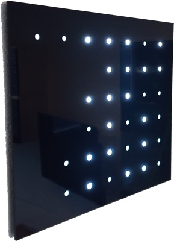

# OAM-BinaryWatch

OpenKNX Firmware und Anwendung einer Binär-Wanduhr, die Uhrzeit und Datum anzeigt.

Die Stromversorgung erfolgt dabei komplett über den Bus.

## Kompatible Hardware

Die Uhr wird aus Acrylglasplatten gefräst, hat eine Größe von 47 x 41 cm und liegt mit nur 15 mm Dicke flach an der Wand an:

<kbd></kbd>

Eine Haupt-PCB ist direkt in die Acrylglasplatten integriert:

<kbd></kbd>

Alle Infos zur kompatiblen Hardware findet sich [hier](https://www.ab-smarthouse.com/produkt/openknx-wanduhr-binaer/) oder bei Interesse einfach Kontakt per [E-Mail](mailto:info@ab-smarthouse.com?subject=[OpenKNX]%20BinaryClock) aufnehmen.